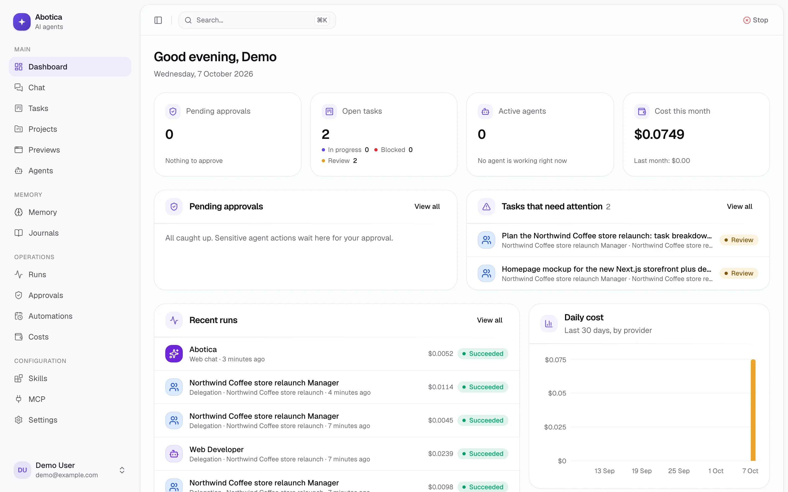
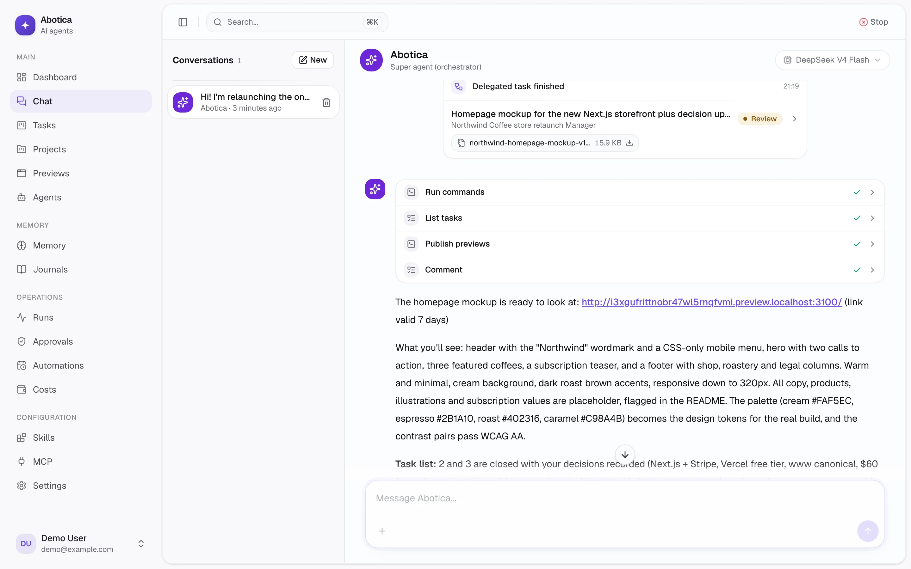
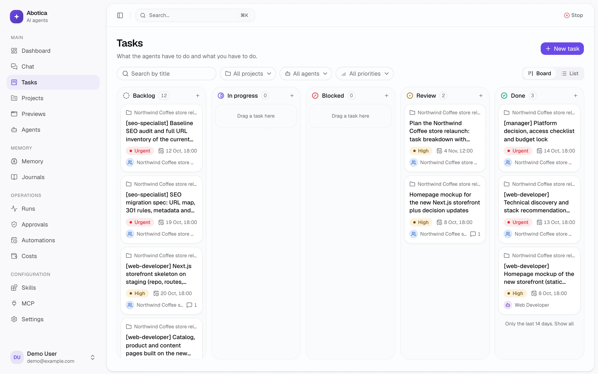
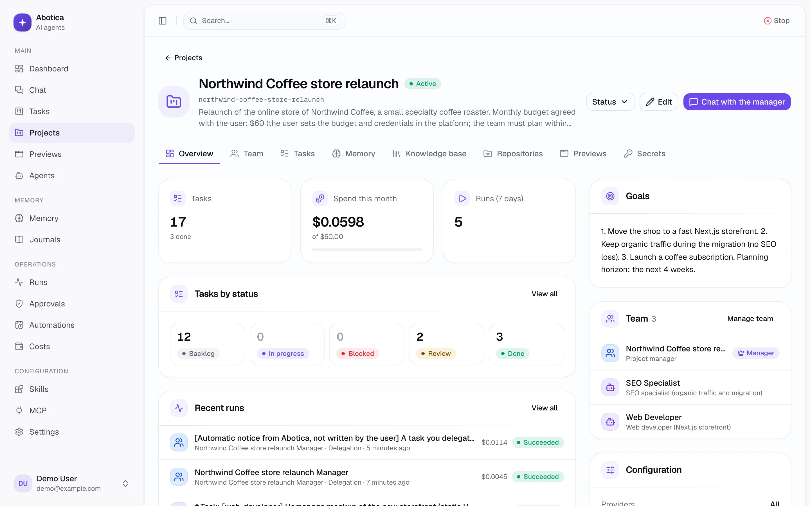
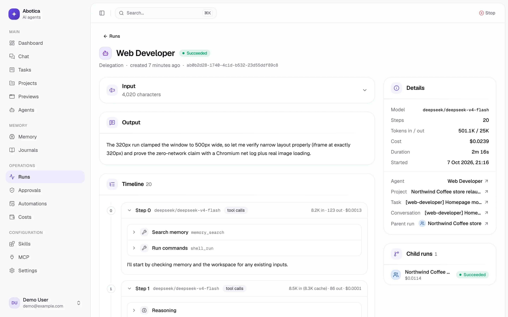
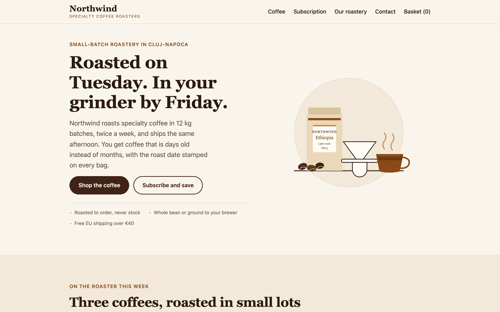

<h1 align="center">
  <picture>
    <source media="(prefers-color-scheme: dark)" srcset="apps/web/public/logo/horizontal-dark.svg">
    
  </picture>
</h1>

<p align="center"><strong>A self-hosted team of AI agents that you run from Telegram or the web.</strong></p>

<p align="center">
  <a href="https://github.com/codevision-ro/abotica/actions/workflows/ci.yml"></a>
  <a href="https://github.com/codevision-ro/abotica/releases"></a>
  <a href="LICENSE"></a>
</p>

You talk to one super agent. It hands project work to each project's manager. The manager splits the work among a team of specialists, reviews what comes back and reports to you. Agents work in their own sandboxed workspaces, keep long-term memory and daily journals, open pull requests and run on schedules. Risky actions wait for your approval.

Abotica is single-user and runs on your own server or computer, with your own model keys.

<picture>
  <source media="(prefers-color-scheme: dark)" srcset=".github/assets/dashboard-dark.webp">
  
</picture>

## Highlights

- **A super agent and real teams.** Three kinds of agents. The super agent is your one point of contact on Telegram and the web. Managers each lead one or more projects: they plan, delegate within the team, send work back when it is not good enough and report the result, but never produce the work themselves. Specialists such as a web developer or an SEO agent do the work and are shared across projects.
- **Agents that do the work, not just talk about it.** Each project gets its own Docker workspace. Agents run shell commands there, install packages, start MySQL, PostgreSQL or Redis, and browse and scrape the web. They hand you the results as files or as preview links to the apps they started.
- **Git-native.** Connect GitHub, GitLab or a self-hosted repository to a project. Each task gets its own worktree and branch, and agents open the pull request. The token never enters the sandbox: git signs in through its egress proxy.
- **Memory that lasts.** Every agent keeps its own memory, globally and per project, next to each project's team memory and the instructions you set for all agents. Semantic search, an end-of-day journal per agent and project, and a weekly consolidation of the facts that matter.
- **Works while you sleep.** Cron and one-shot schedules, signed webhooks, triggers on task events, and daily and weekly digests on Telegram.
- **You stay in control.** Approval per tool, budgets per run, per project and per month with Telegram alerts, a kill switch, an audit log and a step-by-step trace of every run. A project can be limited to chosen providers, for example only local Ollama models for sensitive data.
- **Any model, your keys.** Anthropic, OpenAI (with an API key or your ChatGPT plan), DeepSeek, Kimi and Ollama. Each agent has a fallback chain for rate limits and outages.
- **Extensible.** Agent Skills installed from skills.sh or GitHub, and MCP servers over HTTP (OAuth included) or stdio. Web search, library docs, Playwright and Scrapling come bundled.

## Screenshots

<table>
  <tr>
    <td width="50%">
<picture>
  <source media="(prefers-color-scheme: dark)" srcset=".github/assets/chat-dark.webp">
  
</picture>
      <p align="center"><sub>The super agent reports back on delegated work</sub></p>
    </td>
    <td width="50%">
<picture>
  <source media="(prefers-color-scheme: dark)" srcset=".github/assets/tasks-dark.webp">
  
</picture>
      <p align="center"><sub>Tasks planned and assigned by the project's manager</sub></p>
    </td>
  </tr>
  <tr>
    <td width="50%">
<picture>
  <source media="(prefers-color-scheme: dark)" srcset=".github/assets/project-dark.webp">
  
</picture>
      <p align="center"><sub>A project: budget, progress, goals and team</sub></p>
    </td>
    <td width="50%">
<picture>
  <source media="(prefers-color-scheme: dark)" srcset=".github/assets/run-dark.webp">
  
</picture>
      <p align="center"><sub>Every run, step by step, with tokens and cost</sub></p>
    </td>
  </tr>
  <tr>
    <td colspan="2">
      
      <p align="center"><sub>A homepage mockup the web developer agent built in its sandbox and shared as a preview link</sub></p>
    </td>
  </tr>
</table>

## Install

On a Linux server (amd64 or arm64) or a Mac:

```bash
curl -fsSL https://raw.githubusercontent.com/codevision-ro/abotica/main/install.sh | bash
```

On Windows 10 or 11, with [Docker Desktop](https://www.docker.com/products/docker-desktop/), in PowerShell:

```powershell
irm https://raw.githubusercontent.com/codevision-ro/abotica/main/install.ps1 | iex
```

The script installs Docker if it is missing (Linux; on a Mac, install [OrbStack](https://orbstack.dev) or Docker Desktop first; on Windows it offers to install Docker Desktop with winget). It asks for a domain, generates the secrets and starts everything. With a domain, Abotica is served over HTTPS with automatic certificates. Without one, it runs only on that machine at `http://localhost:3000`.

Then:

1. Open the sign-up link the installer prints and create your account. The link carries a setup code that only you have, so nobody else can claim the instance first.
2. Connect a model provider under **Settings > AI providers**. Keys are stored encrypted, and are set only there.
3. Optionally, connect Telegram ([DEPLOY.md](DEPLOY.md#telegram)) and enable 2FA under **Settings > Security**.

To update, run the same command again. To install with Docker by hand, or without Docker, see [DEPLOY.md](DEPLOY.md).

## Features

**Super agent**
- One point of contact on Telegram and the web, and the only agent that talks on Telegram, in project forum topics too. On the web you can also chat directly with any agent.
- Global: works on projects through their managers, creates projects and schedules, checks recent runs and their cost.
- Creates new agents only after your approval.
- Daily digest at the hour you choose and a weekly digest on Telegram, built from the agents' journals, finished and blocked tasks, failed runs and spend.

**Agents**
- Three kinds: the super agent, managers that lead projects and never produce the work, and specialists that do it and are shared across projects. Abotica tells each kind its place in the team and how it works; your own prompt is a specialist's profession, or optional additional instructions for a manager or the super agent.
- Name, role, avatar and prompt, or start from a template.
- A model per agent with a fallback chain. On rate limits, provider errors, outages or a missing key, the run moves to the next model.
- Reasoning effort per agent, and a model and reasoning override per conversation.
- Tool permissions per agent (allow, ask or deny), down to single MCP tools.
- Limits per run: steps, timeout and budget in USD.
- Every configuration change is versioned, with a diff and restore.

**Projects**
- Description, goals, status, an overview of spend against budget and recent runs.
- A team: a manager that leads it, created with the project from a template or chosen among your managers (one can lead several projects), who answers in the project's conversations on the web and delegates within the team. Add specialists from templates, or share them with other projects.
- Knowledge base (files, documents, links) with semantic search. The original files are copied into the project workspace.
- Git repositories (GitHub, GitLab, self-hosted): cloned in the workspace, with a worktree and branch per task and pull or merge requests opened by agents. The token is checked when you add it and never enters the sandbox: git signs in through its egress proxy. The UI warns when the default branch is not protected.
- Credentials in the vault, used as `{{secret:NAME}}` and never placed in the workspace.
- Monthly budget: runs are refused once it is reached.
- Allowed providers. They cover everything that carries the project's data: runs, journals, memory consolidation, the digest, embeddings, voice transcription in its Telegram topic, and task results reported back to whoever delegated them.
- Optional Telegram forum topic: the project's notifications go there, and the super agent answers there knowing which project it is about.
- Archive, restore, reset the workspace, or delete.

**Tasks**
- Kanban board and list, with columns for backlog, in progress, blocked, review and done.
- Priority, deadline, and assignment to an agent or to you.
- Sub-tasks, dependencies (backlog tasks start on their own once their dependencies are done), comments, history, outputs and attachments.
- Delegated work goes to review: the delegating agent accepts it or sends it back.

**Memory**
- Every agent has its own global memory and its own memory per project; each project also has a team memory its team shares. Instructions for all agents, set in Settings, apply to every agent.
- When entries conflict, a project's team memory wins over your global rules, those over an agent's notes on the project, and its notes over its craft.
- Searched semantically with pgvector, with a built-in multilingual embedding model that needs no API key (OpenAI or Ollama optional). A run sees only its own project. An agent's profession (prompt, skills, tools) stays the same everywhere.
- Optional approval before memory written by agents becomes active.
- End-of-day journal per agent and project. Agents read their last N days of journals for the project they work on.
- Weekly consolidation: an agent's journals of a project become its notes on that project, and the lessons of its craft that hold in any project, stripped of project names, go to its global memory.
- Full history of runs, messages and tool calls, with search over memory and journals.

**Automation**
- Schedules: cron or one-shot, with a timezone, a preview of the next runs and "run now".
- Triggers: webhooks (for example inbound email from your email provider), task created, task done.
- A schedule or trigger of a manager or a specialist runs as a task and reports up like delegated work: a specialist's result goes to the project's manager, who reviews it, then to the super agent, who tells you. A routine result with nothing new ends at the agent that did it, on the task page, and nobody is messaged. A task you give a manager or a specialist yourself tells you on Telegram once it is ready, blocked or failed. A repeating schedule does not fire again while its previous task is still being worked on.
- Webhooks can require signed requests (Standard Webhooks or GitHub signatures) and are rate limited.
- Kill switch that stops every running agent, from the web or Telegram.

**Sandbox**
- A Docker container per workspace: one per project, one per chat without a project. gVisor is used when it is installed.
- Agents run shell commands, install packages (pip, npm, pnpm, Composer, and apt as root when allowed) and create and edit files.
- Python, Node and PHP with Composer preinstalled. Agents can start MySQL (MariaDB), PostgreSQL and Redis servers in their workspace when they need one.
- Network policy per project: off, package registries, chosen domains or any public host. Private and cloud metadata addresses are always refused.
- Limits on memory, CPU and processes per container. Idle containers stop on their own.
- Previews: agents publish mockups and documents, or open apps they started, as links on their own subdomain. Previews are private by default (through your session) or public, and expire on their own.
- Files flow both ways. Files agents share arrive in the chat and on Telegram, and files you attach are copied into the workspace. A delegated task carries the files its agent needs and brings back what it produced.
- Each model gets attachments the way it can read them: text inline, images and PDFs when it supports them, otherwise the file's path.

**Skills and MCP**
- Skills as Agent Skills folders (SKILL.md plus reference files and scripts), edited in the browser, with versions, diff and restore. Scripts run in the sandbox.
- Install skills from skills.sh, GitHub, a zip or a folder. A skill shows when its source has an update.
- Test a skill with any agent in a real chat run.
- MCP servers over HTTP (with OAuth, detected automatically) or stdio, with a connection test. Environment variables and headers can reference vault secrets. Stdio servers run in the sandbox by default, and credential routes give them an API key without putting it in the sandbox.
- Four bundled MCP servers: Parallel Search (web search), Context7 (library documentation), Playwright (browser automation) and Scrapling (scraping, including JavaScript and Cloudflare pages).
- MCP tools load on demand. The agent sees their names and loads the ones it needs, so a long tool list does not cost tokens on every step.
- Assign skills and MCP servers to agents, or to every member of a project.

**Providers and costs**
- Anthropic, OpenAI, DeepSeek, Kimi (Moonshot) and Ollama. OpenAI works with an API key or with your ChatGPT plan.
- Embeddings with a built-in multilingual model that runs in the worker (no key, nothing leaves the machine), or via OpenAI or Ollama. Voice transcription via OpenAI. OpenAI embeddings and transcription need an API key, not the plan.
- Token and cost tracking per agent, project and model.
- Global and per-project monthly budgets, with Telegram alerts at 80% and 100%.

**Security and operations**
- Email and password login with TOTP 2FA. Sign-up closes after the first account.
- Vault for API keys and tokens (AES-256-GCM).
- Human approval for selected tool calls, from the web or with Telegram buttons.
- Audit log, step-by-step run trace, and `GET /api/health`.
- Daily backup of the database and stored files, kept for 14 days (Docker install).
- Interface in English and Romanian.

## How it works

```
apps/web          Next.js: UI, chat API (streams from the worker), webhooks
apps/worker       Agent runs, Telegram bot, schedules, journals, digests, previews
packages/core     Domain logic: agent runner, provider fallback, tools, memory,
                  tasks, approvals, vault, queues
packages/db       Drizzle schema, migrations, seed
packages/i18n     Messages per locale, shared by web and worker
packages/sandbox  Sandboxed workspaces: Docker backend, egress proxy, sessions
```

The web app never runs agents. It creates a run and puts it on a queue. The worker runs it and publishes the stream to Redis, and the web app relays it to the chat. If you reload the page, the stream resumes where it left off. Sandbox containers sit on an internal Docker network with no route out. Their only way to the internet is a proxy in the worker that applies the project's network policy.

| Layer | Technology |
|---|---|
| Web (UI + API) | Next.js 16, React 19, Tailwind v4, shadcn/ui, AI Elements, next-intl |
| Agents | Vercel AI SDK 7, MCP |
| Queues and schedules | BullMQ + Redis |
| Data, memory, semantic search | Postgres 17 + pgvector, Drizzle ORM |
| Auth | better-auth (email + password, TOTP 2FA) |
| Telegram | grammY |

## Documentation

- [DEPLOY.md](DEPLOY.md): installation, update, HTTPS, Telegram, backup and restore, sandbox, previews, Ollama, running without Docker.
- [SECURITY.md](SECURITY.md): the security model, and how to report a vulnerability privately.
- [CONTRIBUTING.md](CONTRIBUTING.md): development setup, project layout, conventions, checks, adding a language.

## License

[GNU Affero General Public License v3.0](LICENSE) (AGPL-3.0-only). Third-party components are listed in [THIRD_PARTY_NOTICES](THIRD_PARTY_NOTICES).
